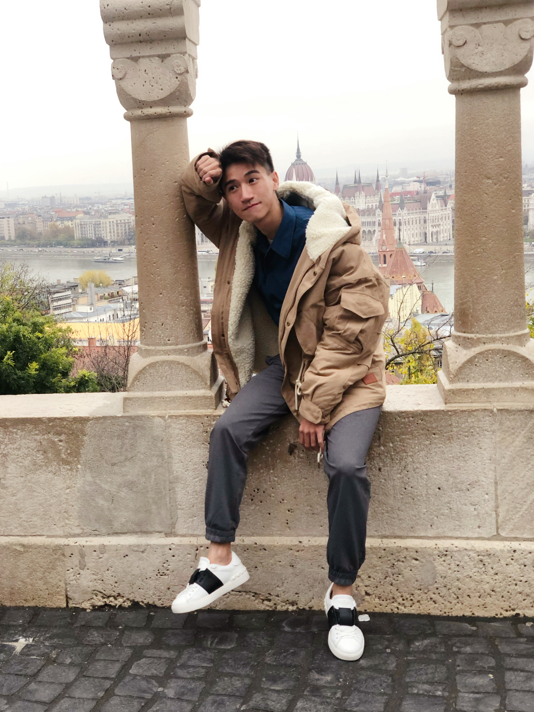

# Welcome to Theo's Org
***
## Someting about me
> I actually hate coldness... but I love the snowing scene

To be fairly honest, I'm a *warm* person... Maybe this is the reason I don't like the cold atmosphere.

I can speak/read/write:
 - Chinese,
 - English,
 - French
 - ...

Btw the way, I've studied in the mediterranean coast, where we have "Nice" weather, slow life......
 

⬆️⬆️ This is the most tranquil town I have lived... We can really enjoy the afternoon at the street Café or ski at the Aples...

## Who I really am?
I'm Theo, (Deng, Zhuolin: 不是卓琳，是林。)
I'm thrilled and pleased to make friends, and good colleagues with you ~ ==@thoughtworks in Xi'an*==.

### this is me.
>@Budapest, Hungary.

(LOL, I have found a street in the town, named by my birthday. ⬇️⬇️)

## Contact
Reach me @zhuolin.deng@outlook.com 
or WetChat~
***
*"le vent qui souffle de la méditerranée, tu m'as manqué".*

